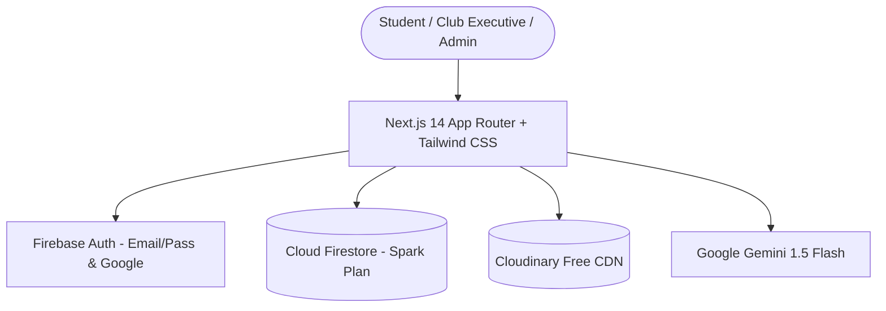

# CampusOS — Unified Academic Hub for City University

[](LICENSE)
[](https://nextjs.org/)
[](https://firebase.google.com/)
[](#free-tier-quota-discipline)
[](#timezone-standardization)

> **CampusOS** is the single unified academic operating portal created for **City University** (Khagan, Birulia, Savar, Dhaka-1340, Bangladesh). Built for the **CPCCU AI-Powered Web App Development & Deployment Hackathon 2026**.

---

## 🏛️ Live Demo & Credentials

- **Live URL:** [Deployed on Vercel](https://cityuniversity-campusos.vercel.app) *(or your live deployment instance)*
- **Judges Evaluation Hub:** [`/judges`](file:///home/rahim/projects/Hackathon2-NoArk/src/app/judges/page.tsx) — Includes a 2-minute walkthrough path, criteria mapping (100 marks), and role credentials.

### Demo Evaluation Accounts

| Role | Email | Password | Key Permissions |
|---|---|---|---|
| **Student** | `student@cityuniversity.edu.bd` | `CampusOS@2026` | Event registration, QR ticket generation, upvoting study notes, report lost items, track complaints |
| **Club Executive** | `cpc.admin@cityuniversity.edu.bd` | `CampusOS@2026` | QR camera ticket check-in scanner, live attendee verification, attendee CSV export |
| **System Admin** | `admin@cityuniversity.edu.bd` | `CampusOS@2026` | Resource moderation queue, verified badging, complaint timeline updates & public notes |

---

## 🔍 The Problem & The Six Student Frictions

City University students regularly juggle scattered Messenger chats, missed event deadlines, unannounced bus route deviations, and lost property without a central campus platform. CampusOS eliminates all six frictions:

| Student Friction | CampusOS Solution | Live Route |
|---|---|---|
| **1. Missed Events** | Unified cross-club feed across all 12 clubs, seat limits, waitlist promotion, Google Calendar & `.ics` export | `/events` |
| **2. Bus Confusion** | 5 routes (R1–R5), stop search, real-time next-bus departure countdown (Asia/Dhaka time) | `/bus` |
| **3. Scattered Study Notes** | Searchable Resource Hub by Course Code (&ldquo;CSE 2101&rdquo;), PDF viewer, 1-vote limit, Gemini AI summary | `/resources` |
| **4. Lost Campus Belongings** | Community registry, verification question protection, interactive &ldquo;This is mine&rdquo; claim flow | `/lost-found` |
| **5. Unheard Grievances** | Anonymous grievance filing, unique tracking ID (`CU-2026-XXXXXX`), public audit trail & admin notes | `/complaints/track` |
| **6. No Single Starting Point** | Grounded Gemini AI assistant (English & Bangla), official waiver policy tables, verified hotlines | `/assistant`, `/helpdesk` |

---

## 🧠 Grounded AI Architecture (Zero Hallucination)

CampusOS integrates **Google Gemini 1.5 Flash** using Retrieval-Augmented Generation (RAG):
1. **Strict Context Gating:** The assistant is supplied only with official university facts (`src/data/official-facts.json`), FAQs, bus routes, and verified event notices.
2. **Refusal Guardrail:** Out-of-scope inquiries are politely refused with a referral to the central desk (`09643-234234`).
3. **Bilingual:** Answers fluently in natural Bangla or English matching the user prompt.
4. **Rate Limited & Quota Guarded:** Protected per user/IP; on 429 quota events it transparently falls back to verified FAQ entries.

---

## 🏗️ System Architecture & Stack



---

## 🛡️ Non-Negotiable Free-Tier Quota Discipline

CampusOS is engineered from day one to operate **100% free with zero cloud bills**:
- **Hosting:** Vercel Hobby Tier.
- **Database & Auth:** Firebase Spark Plan (up to 50K reads/day, cached locally to conserve quota).
- **File Uploads:** Cloudinary Free Plan (client-side compression, max 10MB).
- **AI Processing:** Google Gemini API Free Tier (rate limited with deterministic fallback).

---

## 🚀 Running Locally

### Prerequisites
- Node.js 18+ or 20+
- npm or pnpm

### Setup Instructions

```bash
# 1. Clone repository
git clone https://github.com/cpccu/Hackathon2-NoArk.git
cd Hackathon2-NoArk

# 2. Install dependencies
npm install

# 3. Configure environment variables
cp .env.example .env.local
# (Fill in your Firebase, Cloudinary, and Gemini keys in .env.local)

# 4. Verify seed data
npm run seed

# 5. Launch local development server
npm run dev
```

Visit `http://localhost:3000` to interact with CampusOS.

---

## 📋 Comprehensive Documentation Suite

- [`docs/DEMO_ACCOUNTS.md`](docs/DEMO_ACCOUNTS.md) — Preconfigured student, club executive, and admin credentials.
- [`docs/ARCHITECTURE.md`](docs/ARCHITECTURE.md) — Complete system topology, Firestore security rules, and data flow.
- [`docs/DATA_SOURCES.md`](docs/DATA_SOURCES.md) — Detailed mapping of official university assets vs demo test records.
- [`docs/FREE_TIER.md`](docs/FREE_TIER.md) — Exhaustive quota analysis and budget protection strategies.
- [`docs/TEST_REPORT.md`](docs/TEST_REPORT.md) — Comprehensive QA verification report.
- [`docs/LIGHTHOUSE.md`](docs/LIGHTHOUSE.md) — Performance, accessibility, best practices, and SEO scores.
- [`CONTRIBUTING.md`](CONTRIBUTING.md) — Community code quality and PR guidelines.

---

## 👥 Hackathon Team

- **Team:** NoArk
- **Event:** CPCCU AI-Powered Web App Development & Deployment Hackathon 2026
- **License:** [MIT License](LICENSE)
