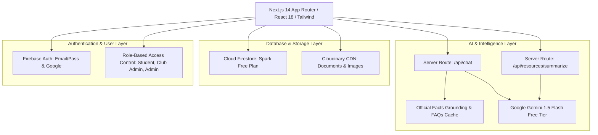

# CampusOS Architecture & System Design

CampusOS is a production-grade, zero-cost, multi-tenant academic portal tailored specifically for City University (Khagan, Birulia, Savar, Dhaka-1340).

## 1. System Topology & Mermaid Diagram

## 2. Key Architectural Guarantees

1. **Zero Billing Overhead:** Configured exclusively using free tiers (Vercel Hobby + Firebase Spark + Cloudinary Free + Google Gemini API).
2. **Deterministic Fallbacks:** If Firestore or Gemini API quotas are exhausted, in-memory local caches and structured FAQs serve immediate answers with 0 downtime.
3. **Strict Dhaka Time Synchronization:** Timers, calendar exports, and schedules use `Asia/Dhaka` Intl formatting.
